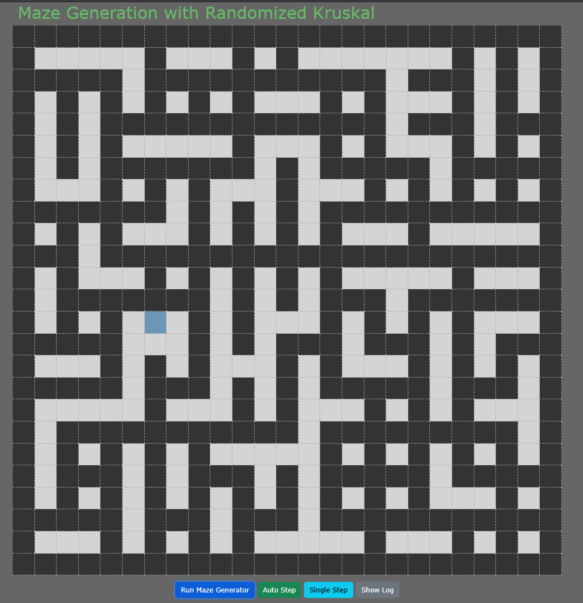

# Randomized Kruskal Maze Generation

Github: https://github.com/AndyTheDragon/maze

Deployed: https://andythedragon.github.io/maze/

## Authors
Frederik Franck | MojoOno | cph-ff72@stud.ek.dk 

André Samuelsen | AndyTheDragon | cph-as760@stud.ek.dk 

Mathias Falcham | Falcho | cph-mf398@stud.ek.dk

## Resumé
Dette projekt er en implementering samt visualisering af en algoritme, der kan generere en “perfect maze”. En “perfect maze” er en labyrint, som har én rute fra et hvilket som helst sted i labyrinten, til et hvilket som helst andet sted. Der må ikke være loops. Der må ikke være steder som er utilgængelige. Med andre ord, så er det faktisk lige meget hvor ind/udgangen er, så længe de rammer den ydre væg.
Når man genererer en labyrint i vores program, starter man med en masse veje som ikke er forbundne, dvs de er adskilt af vægge. Så vælges der en tilfældig indre væg i labyrinten. Denne tilfældige væg har “naboer” til nord, syd, øst og vest. Hvis naboerne til “nord/syd” eller “øst/vest” er “veje”, og de ikke allerede er forbundne, så skal væggen fjernes og alle tre (polerne + væggen) forbindes. Dette fortsættes indtil samtlige “veje” i labyrinten er forbundet. Når denne betingelse er mødt, er labyrinten komplet, og man har en “perfect maze”.

## Produktet
Vi har lavet en randomiseret Kruskal algoritme som er implementeret ved hjælp af et MVC mønster samt diverse datastrukturer og en shuffle algoritme. Vi har en HTML side der viser en række `
` tags som repræsenterer en labyrint, en række knapper, der stepper igennem algoritmen på nogle forskellige måder og et input felt hvor du kan bestemme dimensionen af labyrinten. Hver celle i vores gitter repræsenterer enten en væg eller en vej. Siden algoritmen fungerer ved at have en masse veje som ikke er forbundne fra start, og kanten af labyrinten skal bestå af vægge - så betyder det at vi skal have et ulige antal rækker og kolonner.
